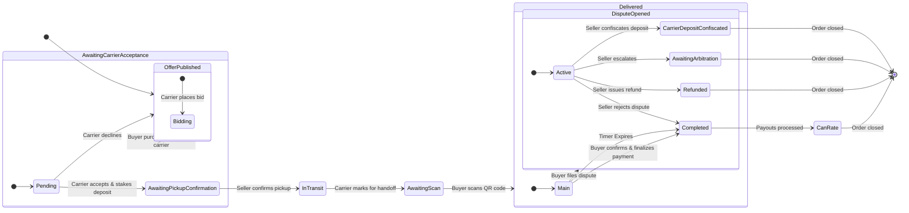

# Decentralized Escrow Marketplace (dMarket)

[](https://shields.io/)
[](https://shields.io/)

## Overview

This project is a sophisticated web application that simulates a decentralized marketplace (DApp) featuring a robust 3-party escrow system. It creates a trustless environment for transactions involving a **Seller**, a **Buyer**, and a **Carrier**. The seller publishes offers, carriers bid to deliver them, and the buyer purchases the item while simultaneously selecting their preferred carrier. Funds are managed through a simulated smart contract escrow system, ensuring that the carrier makes a security deposit and all parties are paid out only upon successful, confirmed delivery. The entire process is wrapped in a shiny, modern, and highly user-friendly graphical interface.

---

## Key Features

- **Role-Based Interface**: Users can seamlessly switch between Buyer, Seller, and Carrier views to manage their specific tasks.
- **Carrier Bidding System**: Carriers can browse available offers and place competitive bids for the delivery fee, creating a dynamic market for logistics.
- **Informed Buyer Choice**: Buyers can view an offer's details in a sophisticated modal, compare all bidding carriers based on their fee and reputation, and select their preferred option at the time of purchase.
- **AI-Powered Offer Creation**: Sellers can optionally leave the item description blank, and the application will use the Google Gemini API to generate a compelling product description automatically.
- **Secure QR Code Handoff**: To confirm delivery, the carrier displays a unique QR code which the buyer must scan, ensuring a secure and verifiable in-person handoff.
- **Automated Escrow Failsafe**: Once an item is delivered, a confirmation timer begins. If the buyer takes no action (e.g., finalize or dispute) within the time limit, the system automatically finalizes the payment, ensuring sellers and carriers are never left in limbo.
- **Advanced Dispute Resolution**: Buyers can open a dispute on delivered items. Sellers are then presented with a detailed resolution modal where they can choose to:
    - **Issue a full refund**: Returns the funds to the buyer.
    - **Reject the dispute**: Finalizes payment to the seller and carrier.
    - **Confiscate Carrier's Deposit**: Refunds the buyer from the carrier's deposit if the carrier is at fault (e.g., lost item).
    - **Escalate to an arbitrator**: Moves the issue to a third party for review.
- **360-Degree Reputation System**: After a transaction is complete, all participating parties can rate each other on a 5-star scale, contributing to a community-driven trust system.
- **Dynamic Leaderboards**: A "Top Performers" panel showcases the highest-rated Sellers, Buyers, and Carriers.
- **Modern & Responsive UI**: Built with React and styled with Tailwind CSS for a sleek, visually appealing, and responsive user experience.

---

## Detailed Order Fulfillment Lifecycle

The core of the application is its precise and secure order state machine, now featuring a competitive bidding process and carrier commitment.

**1. Offer Published (Seller)**
   - A **Seller** creates a new offer for an item. The offer appears on the main marketplace.

**2. Carriers Bid on Delivery (Carrier)**
   - **Carriers** browse the available offers and can place a bid on any item they wish to deliver, specifying their delivery fee.

**3. Buyer Purchases Item & Selects Carrier (Buyer)**
   - A **Buyer** views an offer and selects their preferred carrier from the list of bidders.
   - Upon purchase, a new order is created with the status `Awaiting Carrier Acceptance`. The original offer is removed from the marketplace.

**4. Carrier Accepts or Declines (Carrier)**
   - The selected **Carrier** is notified and sees the pending order in their dashboard. They have two choices:
     - **Accept & Stake Deposit**: The carrier accepts the job, which simulates staking their security deposit. The order status changes to `Awaiting Pickup Confirmation`.
     - **Decline**: If the carrier declines, the order is cancelled, and the original offer is **re-listed on the marketplace** (minus the declined carrier's bid), allowing the buyer to choose another carrier.

**5. Seller Confirms Pickup (Seller)**
   - The **Seller** physically hands the item to the committed carrier and then confirms this by clicking "Confirm Carrier Pickup".
   - The order status changes to `In Transit`.

**6. Carrier Initiates Handoff (Carrier)**
   - Upon arrival at the buyer's location, the **Carrier** marks the order as delivered. This moves the order to `Awaiting Scan Confirmation` and generates a unique QR code on the carrier's screen.

**7. Buyer Confirms via QR Scan (Buyer)**
   - The **Buyer** scans the QR code presented by the carrier. This secure action confirms the physical handoff, and the order status changes to `Delivered`.

**8. Buyer's Confirmation Window (Timed Failsafe)**
   - A **confirmation timer** (e.g., 72 hours, simulated as 2 minutes) begins. The **Buyer** has this window to inspect the item and take action:
     - **Finalize Payment**: If the item is acceptable, the buyer confirms, moving the order to `Completed`.
     - **File a Dispute**: If there's an issue, the buyer files a dispute, moving the order to `Dispute Opened` and pausing the timer.
     - **If no action is taken**: When the timer expires, the system **automatically moves the order to `Completed`**, ensuring the seller and carrier are paid.

**9. Rating (All Parties)**
   - Once an order is `Completed`, all three parties can rate each other, updating their reputation scores.

---

## Order State Transition Diagram

The following diagram illustrates the complete lifecycle of an order, from its creation to its final resolution.



---

## Prerequisites

- **Node.js**: v18 or higher
- **npm** or **yarn** package manager
- [Midnight Lace wallet extension](https://chromewebstore.google.com/detail/lace-beta/hgeekaiplokcnmakghbdfbgnlfheichg) installed in your browser

---

## Installation

```bash
# Install dependencies
npm install

# Or using yarn
yarn install
```

---

## Development

```bash
# Start development server
npm run dev

# Or using yarn
yarn dev
```

The app will be available at `http://localhost:5173`

---

## Useful Links

- [Midnight Network Documentation](https://docs.midnight.network)
- [Lace Wallet Documentation](https://docs.midnight.network/getting-started/installation#install-the-lace-midnight-preview-wallet)
- [React Documentation](https://react.dev)
